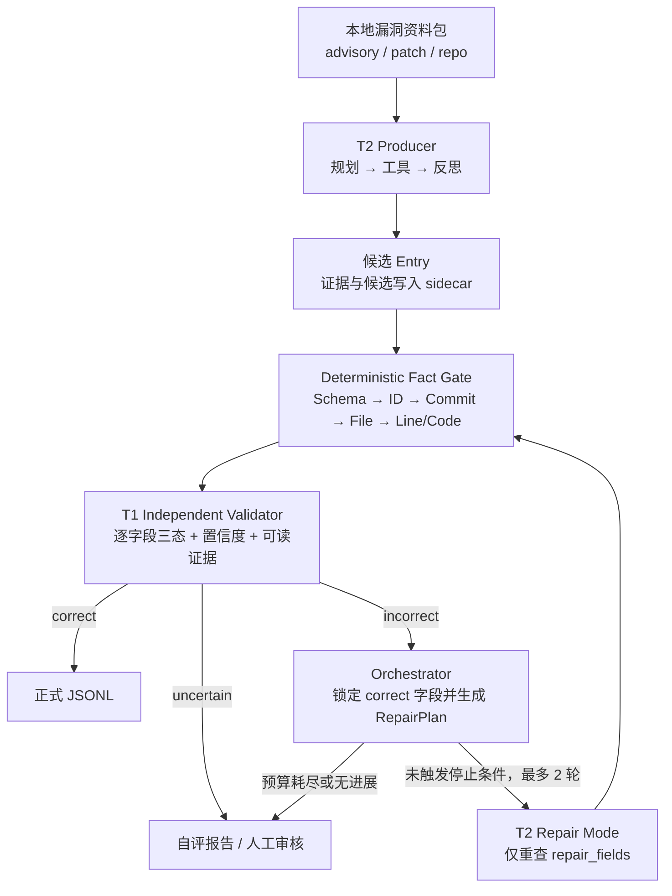

# VulnGym T1 × T2 自动化闭环：B-v2 首版设计

> 状态：确定性 T1 基础、受控闭环编排、本地结构化 T2 Producer、离线批处理/replay artifact 纵切、benchmark 阶段 A/B 的公开契约与投影 harness，以及阶段 C 的 sealed source snapshot 准备/校验边界，2026-08-20。本文以考题、`SCHEMA.md` 和 B-v2 计划书为边界；“已实现”不表示 source-only multi-finding T2、独立语义 T1、在线模型接入或最终数据验收已经完成。

## 1. 目标与总体架构

B-v2 用 T2 生产候选，Fact Gate 消除可机械核验的错误，再由与 T2 推理隔离的 T1 逐字段盲审。T1 发现明确错误后，Orchestrator 生成 `RepairPlan`，T2 只重做错误字段；初始候选之后最多自动修复两轮，仍不收敛或证据不足则转人工。



T1 只接收原始资料包和待审 Entry，不读取 T2 的推理或自报置信度。T2 的 Planner、Semantic Judge 与 Reflection 已有严格 JSON 模型调用边界，并只能引用受控工具签发的候选和证据；这仍不等于语义正确性已经得到证明。独立 T1 的完整语义正判、反证审查与全字段裁决仍待实现。

## 2. 核心契约

### 2.1 Deterministic-first 与语义边界

硬事实按 `Schema/ID → commit 对象 → 精确路径 → 行号 → ±5 行代码匹配` 执行，失败直接形成结构化证据。通过门禁只代表“事实存在”：commit 存在不证明它是漏洞版本，代码匹配也不证明外部可达性或漏洞语义。因此 `fact_status=correct` 仍可对应 `status=uncertain`，语义必须由公告、patch 和漏洞版本源码交叉裁决。

`critical_operation` 采用双模式：

- **Sink 模式**：面向 XSS、注入、SSRF、路径访问等，从 patch 找危险操作变化，再回到漏洞 commit 确认真正 sink；不得引用修复后新增代码。
- **Guard 模式**：面向鉴权、租户隔离和状态机错误，定位错误/缺失的条件、归属检查或提前返回点。若漏洞版本没有有证据的可落地位置，则转人工，不能虚构行号。

Entry Point 需由路由、RPC/CLI、消息回调或反向调用关系证明“外部可达”。完整 trace 可为空数组，不能为补链而虚构节点。

### 2.2 正式输出、sidecar 与证据

| 边界 | 内容 | 约束 |
| --- | --- | --- |
| `<output-dir>/entries.jsonl` | 已 finalized 的正式 Entry | 仅 15 个 Schema 字段；`verify=0`；只有 `correct` T1 报告闭合的结果才能进入。 |
| `<output-dir>/validation.jsonl` | 正式 T1 报告流 | 保留实际形成的终态报告；与 attempt 级 `validations.jsonl` sidecar 区分。 |
| `<output-dir>/* sidecar` | 内部 replay 记录 | `states/candidates/validations/evidence/tool_calls/model_calls/repair_history/deferred/errors`；不得回流污染 Entry。 |
| `<output-dir>/run_manifest.jsonl` | 数据集闭合清单 | 对所有文件、根记录、数量和 digest 建立一次事务内的闭合。 |

闭环 writer 在同一个 sibling staging 事务中写入并复核 `entries.jsonl`、
`validation.jsonl`、全部 sidecar 和 `run_manifest.jsonl`，成功后才发布此前不存在的
输出目录。输出目录不能与 task、fixture、repo map、资料包或仓库输入重叠。

统一证据模型如下；`line_start`/`line_end` 如出现必须成对且有序：

```json
{
  "evidence_id": "EV-GHSA-001-SOURCE-04",
  "report_id": "GHSA-W7XJ-8FX7-WFCH",
  "source_type": "source",
  "commit": "9942de8011d4b5a141ac507c974c061c0cdad59a",
  "file": "src/lib/components/common/RichTextInput.svelte",
  "line_start": 348,
  "line_end": 348,
  "snippet": "tempDiv.innerHTML = htmlContent;",
  "tool_call_id": "TOOL-00031"
}
```

`source_type` 取 `advisory/patch/source/git/schema` 之一；除 `evidence_id/report_id/source_type/snippet` 外，其余字段可选。`evidence_refs` 只用于追踪；T1 报告仍须内嵌可读证据。正式必填事实拿不到时不伪造 Entry：`vuln_ids`、`trace` 可用合法空数组，其余关键缺失进入人工队列。

### 2.3 离线、只读与预算

证据层默认离线：只读本地公告、patch 和仓库，禁止 HTTP 取数、`git fetch`、答案 API、执行仓库二进制/安装脚本或动态导入目标代码。严格离线配置使用本地模型；若显式启用远程 LLM，只发送最少片段，API Key 不入库、不入日志。

Git 工具用固定参数数组读取 `cat-file/ls-tree/show`，无任意 shell，不 checkout、不运行 hook/diff driver/textconv；校验 SHA 和相对路径，拒绝绝对路径、`..` 与选项/pathspec 注入，并限制超时和 blob 大小。确定性门禁只接受对象库位于授权根目录内的普通 clone/bare repo，拒绝 gitfile、`commondir`、alternate object database 和 `info/grafts` 历史覆盖；固定 `core.commitGraph=false` 使祖先关系回到原始 commit 对象，并以 `GIT_NO_REPLACE_OBJECTS=1` / `GIT_NO_LAZY_FETCH=1` 阻止 replace refs 与 partial clone 隐式联网/写对象。AST 如需展开源码，只能由后续受控工具创建每任务独立临时目录，不能把该目录绕回只读事实门禁。

确定性输入门禁已接入资源上限：默认单行 JSONL 1 MiB、每批 10,000 条、每条 trace 64 节点、每包 64 个文件；对应硬上限为 32 MiB、100,000 条、256 节点和 256 文件。超限在仓库/Git 扇出前形成结构化单条错误，超长行以固定大小缓冲排空。闭环预算默认每任务 `max_llm_calls=16`、`max_tool_calls=80`、`max_repair_iterations=2`；调用开始前计费，失败不退款，事件账本可用于确定性的内部一致性对账。全字段正确、只剩 `uncertain`、两轮耗尽、无变化/错误重复、预算耗尽、改坏锁定字段、原正确字段回归或证据冲突时立即停止。`uncertain` 不会被自动改写，直接进入人工分流。

### 2.4 批处理与 replay artifact 契约

`python -m vulngym_agent.closed_loop_cli` 每个物理 JSONL 行只接受一个严格
`RunTask`：根对象恰好含 `task_id/report_id/entry_id/inputs`；`inputs` 恰好含
`contract_version/input_line/repo_url/package/hints`，其中 `input_line` 必须等于物理
行号。任务不携带本机根目录。受信配置另行提供绝对 `--package-root`，以及结构为
`{"contract_version":1,"repositories":[{"repo_url":...,"path":...}]}` 的严格 repo
map；URL 必须是 canonical GitHub URL，并按精确值映射到绝对本地 repository root。
package root 与所有 repo root 必须互不包含。

当前批处理只提供离线 `ExactReplayBackend`，不包含在线模型 provider。fixture 根对象
恰好含 `contract_version=2/backend_id/model_id/responses`；每个 response 离散保存并核对
完整的不可变 `ModelRequest` 身份：`task_id`、`attempt`、`policy_scope`、`stage`、
`model_call_id`、`backend_id`、`model_id` 与 `request_sha256`，再附
`status/response/error_code`。查找直接使用这组无碰撞字段 tuple，不能用一个调用方提供或
经分隔符拼接的 operation 字符串替代逐字段绑定。fixture 不保存原始 request 或 prompt，
且每组身份必须恰好消费一次；缺失、复用或剩余 fixture 都会使整个 staging 事务失败。
它只是离线测试/复现输入，不是 gold，不代表独立 T1 结论。隐藏验收 gold 必须在物理上
位于 task、fixture、package 与 repository root 之外，并禁止用于准备模型响应。

最小执行示例：

```bash
python -m vulngym_agent.closed_loop_cli \
  --tasks tasks.jsonl \
  --replay-responses replay-responses.json \
  --repo-map repo-map.json \
  --package-root /srv/vulngym/packages \
  --output-dir /srv/vulngym/runs/run-001
```

输出父目录必须已存在，`--output-dir` 本身必须不存在。退出码 `0` 表示无输入/任务
失败；默认允许 `manual_review`。退出码 `1` 表示出现输入/任务失败，或启用
`--require-all-finalized` 后存在人工审核结果；退出码 `2` 表示配置/I/O、task 总字节
超限或 exact replay 闭合等致命错误。task 输入默认单行 1 MiB、总文件 64 MiB、
10,000 条记录，可由 `--max-input-line-bytes`、`--max-task-bytes`、`--max-records`
调整，硬上限依次是 32 MiB、1 GiB、100,000。fixture 默认上限另为 16 MiB 与
50,000 个响应。若 `--max-records` 截断批次并留下后续记录对应的 unused fixture，
exact closure 会使整批拒绝发布；artifact reader/writer 还以 `ReplayLimits` 约束单文件
记录数、单行和总字节。

落盘集合固定包含 `entries.jsonl`、`validation.jsonl`、`states.jsonl`、
`candidates.jsonl`、`validations.jsonl`、`evidence.jsonl`、`tool_calls.jsonl`、
`model_calls.jsonl`、`repair_history.jsonl`、`deferred.jsonl`、`errors.jsonl` 与
`run_manifest.jsonl`。可在不运行 T1、T2、Git 或模型的情况下读取和验算：

```python
from vulngym_agent.orchestrator import (
    read_closed_loop_artifacts,
    verify_closed_loop_artifacts,
)

bundle = read_closed_loop_artifacts("/srv/vulngym/runs/run-001")
manifest = verify_closed_loop_artifacts("/srv/vulngym/runs/run-001")
```

T1 只读原始资料包和正式候选，不读取 model-call sidecar。artifact 不保存 raw model
prompt/response、Producer assumptions、异常文本或配置的本机根目录；model-call 仅保留
可闭合的元数据与 digest。不过 Evidence snippet 和 Entry Schema 要求的代码片段会被
有界保留，因此只应写入公开或已获许可的内容，并将整个目录留在私有仓库或其他受控
位置。digest/哈希链没有签名能力，只能检查内部一致性，不能把 fixture 或 artifact
提升为外部事实来源。

### 2.5 固定公开 benchmark harness（阶段 A/B）

`python -m vulngym_agent.benchmark_cli` 将独立数据生产流程的公开 bundle 接到 B-v2，
但 bundle 不复制进本实现仓库。受信 harness 主机把它作为外部只读目录挂载，并通过
`--benchmark-root` 显式传入。运行时 profile 固定为 `vulngym-50-20-v1`，来源 revision
固定为 `cd69f7e163e08485ab5496115ae03439cda6e27e`，公开 manifest SHA-256 固定为
`d4ef4a663a30a39d2ccd89dc89f70d19a06686ae86179c537cd5139b8ff00a73`。reader 不做目录
发现，只允许读取固定 manifest、record schema、manifest schema、公开 train JSONL 和
公开 test JSONL；profile、revision、artifact digest、Schema 或集合不一致时 fail closed。

四个命令的职责与发布物如下：

| 命令 | 行为 | 原子输出 |
| --- | --- | --- |
| `validate --benchmark-root <external-read-only-root>` | 校验完整固定公开 profile，只在 stdout 返回计数摘要 | 无目录输出 |
| `export-tasks --split train\|test --output-dir <new-dir>` | 导出仅含 task/repo/commit/split/instruction 的无答案源码快照任务 | `tasks.jsonl`、`manifest.json` |
| `project-train --artifact-root ... --bundle-index ... --bundle-index-sha256 ... --output-dir <new-dir>` | 完整校验每题 replay、投影一对多 finding，最后调用公开训练 oracle | `findings.jsonl`、`task_results.jsonl`、`aggregate.json`、`manifest.json` |
| `project-test --artifact-root ... --bundle-index ... --bundle-index-sha256 ... --output-dir <new-dir>` | 完整校验每题 replay 并形成盲测提交；不读 train 文件、不调用 oracle | `findings.jsonl`、`task_results.jsonl`、`manifest.json`；无分数与 `aggregate.json` |

所有 `output-dir` 必须事先不存在，且不能与 benchmark、artifact root 或 index 重叠。
发布使用 sibling staging 和 no-replace rename，失败时不暴露半成品。训练 oracle 的
`aggregate.json` 只包含总数、命中数、recall 与提交 finding 数，不输出 task、advisory、
Entry 身份或逐项匹配。test 专用 reader 只打开固定 manifest、两个 Schema 与 test JSONL，
不会触碰公开训练答案。

投影前必须由受信评测端提供严格 bundle index 及其精确文件字节 SHA-256；CLI 的
`--bundle-index-sha256` 没有默认值。index 根对象和数组项都拒绝额外键：

```json
{"bundles":[{"dataset_sha256":"<64-lower-case-replay-dataset-sha256>","task_id":"VG-TEST-<20-UPPER-HEX>"}],"contract_version":1,"manifest_sha256":"d4ef4a663a30a39d2ccd89dc89f70d19a06686ae86179c537cd5139b8ff00a73","profile_id":"vulngym-50-20-v1","split":"test"}
```

`bundles` 必须与选定 split 的 task 集合精确相等：每题一次、不得缺少或增加，task ID
与 `dataset_sha256` 都不得重复；每个 digest 绑定 `<artifact-root>/<task_id>` 下的一份
完整 closed-loop replay 数据集。reader 会在投影前核对固定文件集合、引用拓扑、终态、
计数、资源上限与预期 dataset digest；所有 replay 都完成后才允许训练 oracle 或发布。
这些 SHA 能证明“读到的字节与受信调用方给出的预期值一致”并发现损坏，却不是签名，
不能证明源码快照、fixture、公告或模型判断的来源真实性。

Entry 投影按 task 的 `repo_url + commit` 重新绑定，支持同一源码快照输出多个 finding，
对等价端点稳定去重。每题默认保留 Top 64，`--top-k` 硬上限为 256；公开训练 oracle
固定使用 official inclusive 行号容差 5。训练 gold 只在 finding 已跨过 Producer/投影
边界后由 aggregate oracle 使用，绝不能转换成 `RunTask`、hint、fixture 或候选 Entry。

阶段 A/B 只解决“公开数据契约与结果投影”，没有解决“从纯源码发现漏洞”。阶段 C 已按
下节实现源码交付边界，但现有 `LocalStructuredT2Producer` 仍依赖公告、fix commit 与
显式 source hints，不能直接执行 source-only 题目。以下阶段仍是验收前置条件：

- **D：source-only T2/T1** —— 新增 snapshot 级、一对多 finding T2，并以不共享其推理
  的独立 semantic T1 完成正反证裁决。
- **E：隔离 50/20 运行** —— 在逐题断网 sandbox 中执行并由独立 evaluator 汇总验收。

### 2.6 Sealed source snapshot（阶段 C）

阶段 C 把“受信 Git 对象库”与“Agent 可读源码”分成两个安全域。受信 preparer 可读取
完整本地 source repo，但必须按无答案 task export 指定的精确 `repo_url + commit` 解析
commit 及其 root tree；它只物化该 tree 中允许的普通文件到
`bundles/<task_id>/tree`。发布树没有 `.git`、父提交、future fix 或 object database。
符号链接、junction/reparse point、Gitlink/submodule、LFS pointer、空目录、不安全路径、
大小写/前缀碰撞，以及 shallow、alternate、graft 等不受支持的 Git 存储条件都会拒绝。

每题 `control/manifest.jsonl` 是严格 canonical JSONL。header 绑定 task ID、精确 repo URL、
commit、root tree OID 与固定 policy；file record 绑定相对路径、Git mode、blob OID、
字节数与 SHA-256；footer 绑定逐项内容根和汇总量。`control/attestation.json` 使用
HMAC-SHA256 对 manifest 精确字节及 key ID 做域分离认证。外层批次 manifest 再绑定
profile/schema/split、公开 manifest digest、`tasks.jsonl` digest、source-map digest、
全部 task snapshot manifest/content root 和总量，外层 HMAC 同样绑定 key ID。HMAC 只在掌握评测密钥的受信域内提供
完整性与预期字节绑定；它不是公开可验证的来源签名，也不提供非否认或外部事实真实性。

source-map 是独立、严格、canonical 的受信配置，`sources` 必须按 repo URL 与 commit
排序，并以精确 `(repo_url, commit)` 集合覆盖 task export，不能缺少、增加或重复；每项
只把该身份映射到一个 canonical absolute `repo_root`。`prepare` 必须同时取得 task JSONL
与 source-map 精确文件字节的 SHA-256 pin，以及固定 public profile manifest digest，避免
目录发现或调用方默默替换输入。`verify-batch` 则必须取得 sealed batch manifest 的精确
SHA-256、同一 HMAC key 和
预期 key ID，并深度复验外层布局和每题 tree：

```bash
python -m vulngym_agent.snapshot_cli prepare \
  --task-export-dir /srv/vulngym/exports/test-tasks \
  --expected-tasks-sha256 <tasks-jsonl-sha256> \
  --expected-public-manifest-sha256 <public-manifest-sha256> \
  --source-map /srv/vulngym/config/source-map.json \
  --expected-source-map-sha256 <source-map-file-sha256> \
  --output-dir /srv/vulngym/sealed/test \
  --key-file /srv/vulngym/secrets/snapshot-hmac.key \
  --key-id evaluator-snapshot-v1

python -m vulngym_agent.snapshot_cli verify-batch \
  --sealed-root /srv/vulngym/sealed/test \
  --expected-manifest-sha256 <sealed-batch-manifest-sha256> \
  --key-file /srv/vulngym/secrets/snapshot-hmac.key \
  --expected-key-id evaluator-snapshot-v1
```

preparer 在一个 sibling staging 中完成全部任务：每题先生成并完整校验，外层 manifest
闭合后再逐题完整校验一次，最后以一次 no-replace rename 发布整批；任一题失败都不会
发布半批结果。固定批次上限为 100 个 task、1,000,000 个文件、1,000,000 个路径节点和
16 GiB 文件内容。POSIX 的 `renameat2(RENAME_NOREPLACE)` 与 Windows 针对 staging
directory handle 的 rename 分别是提交点。提交点成功后若 destination identity、parent
identity 或 durability 无法确认，会返回 `publication_commit_uncertain`（单题层相应为
`snapshot_publication_uncertain`）；调用方须把目标视为可能已提交，并用预期 manifest
重新校验，绝不能依赖可能已被并发替换的路径名做回滚或删除。

运行 Agent 时，evaluator 只把单题 `tree/` 以只读 mount/ACL 交给该任务；同一 sandbox
只再提供一条无答案 task 和有界输出位置，并关闭网络。`control/`、HMAC key、source repo、
其他 task tree、benchmark 仓库、训练 split、生成器输入、评测日志与 gold 都不可见。
因此阶段 C 证明的是“Agent 读取到的 source-only 字节与受信 preparer 所选 Git 对象一致”，
并不提供发现或语义正确性结论；后者属于阶段 D。

最终盲测的评分真值必须物理隔离在独立评测端存储中。每个 Producer sandbox 只挂载一条
无答案任务、该题 sealed tree 与有界输出位置；不得挂载 benchmark 仓库、训练 split、
原始数据/生成器输入、评测日志或评分材料。trusted evaluator 在 Producer 退出后再读取
公开 test 契约和已闭合 replay 进行投影，评分进程与 Producer 也必须分离。

## 3. 交付边界与实施状态

### Standard 与 Bonus

B-v2 的 Standard 包含：T1 全核心字段三态、可读证据、多源与批处理；T2 全必填字段、漏洞/fix commit 区分、真实代码位置和 Entry/Critical 语义；以及基础 Guard、Fact Gate、两轮修复、错误隔离和离线安全。B-v2 将题目加分方向中的 Guard 与 T1×T2 联动提升为 Standard。

Bonus 后置为完整 trace、多语言 AST/轻量数据流、系统性错误归因、复杂 merge/backport、完整 taint 与自动发布。Standard 不建设第三个 Repair Agent、通用平台或远程 Artifact Store。

### 当前已实现：受控编排与本地结构化 T2 Producer 纵切

- 三份严格机器契约：Entry、Validation、Evidence Schema；`additionalProperties=false`，并有 `EvidenceItem`、`FieldValidation`、`ValidationReport` 可序列化模型。
- `SchemaAdapter` 覆盖 15 个正式字段、额外/缺失字段、行范围、GHSA URL 与 `report_id` 一致性、ID 大写/去重/CVE-before-GHSA 排序及正式 T2 的 `verify=0`；它不会补造内容字段。
- `LocalEvidencePackage` 支持每行 `{"package": {...}, "entry": {...}}`，在显式只读根内读取必填公告和可选引用/patch。它拒绝绝对路径、盘符/UNC、`..`、反斜杠、控制符、符号链接、junction/reparse point、重复路径和越界输出；默认单文件/单包/文件数上限为 8 MiB、32 MiB、64，并记录原始字节 SHA-256。加载前后核对完整父链 identity；POSIX 支持时逐级使用目录句柄与 no-follow 打开，Windows 额外核对已打开句柄的最终内核路径。原始 Entry 行继续兼容。
- 公告事实层只提取正文中出现的 GHSA/CVE 和显式标注的 fix commit；`report_id/source_link/vuln_ids` 可与本地公告独立核对。缺公告、不可读或歧义返回 `uncertain`，明确错配与危险资料路径返回 `incorrect`。
- 只读 `GitRepository` 除对象/路径/源码外，已支持全部父提交、祖先关系、历史完整性判断和有界的进程内 UTF-8 unified diff；仍不执行 checkout/fetch/hook/textconv/diff driver。`CommitTransitionValidator` 能明确拒绝 candidate==fix、非祖先和声明路径未变化；正向拓扑/diff 事实仍不冒充漏洞语义证明。
- `T1DeterministicValidator` 已将公告与 Git 历史事实接入字段级报告；无法读取的可选 package 文件通过 `evidence_package=uncertain`、闭合 Evidence 引用与 `missing_information` 明示，不会静默丢弃。`python -m vulngym_agent` 支持 JSONL 逐行错误隔离、单仓库或 `repo_url → 本地路径` 映射，并原子写出 `validation.jsonl`、`evidence.jsonl` 与 `run_manifest.jsonl`。
- `PatchAnalyzer` 有界解析 Git 或本地 unified diff，输出 changed files/hunks、added/removed 坐标、Guard/early-return/removed-dangerous-call 词法候选、冲突与未决项；本地 patch 可与同一路径的不可变 Git diff 交叉核对。解析事实与漏洞语义分开，`semantic_status` 固定为 `uncertain`。
- `CriticalOperationResolver` 以 Sink/Guard 双模式核对候选是否位于漏洞 commit 的真实源码及 fix diff 的 removed/replaced side。fix 新增 Guard 只作为旧版控制流缺口线索，不会被转换为漏洞版本位置；即使事实完全吻合，最终角色仍为 `uncertain`。
- `EntryPointSearcher` 只读取调用者显式提供的不可变 Git blob，支持 Python、JS/TS、Java、Go、Ruby、PHP 的 route/RPC/CLI/handler/export 结构线索，并执行文件数、总字节和候选数预算。它不枚举仓库，也不声称运行时可达性或到达 Critical 的调用图已经证明。
- `T1DeterministicValidator` 已组合以上三层：Patch 解析失败被隔离到单条记录，字段仍保留可读证据与完整 evidence refs；结构事实绝不把 Entry/Critical 字段提升为语义 `correct`。以上仍是确定性 T1 基础设施，不是完整的语义 T1。
- `T2TaskInputV1` 是严格、版本化、无本机路径的任务契约。公告/patch 相对路径、规范化 GitHub URL 和有界 hints 都视为不受信任务数据；本地资料根、仓库映射、模型后端和凭据只存在于受信进程配置中。
- `ProducerExecutionContext` 由 Orchestrator 持有的 attempt controller 签发，`LocalT2ContextFactory` 才能把无路径任务绑定到受信本地根、固定工具注册表和模型后端。Producer 不能自行扩大工具 allowlist、伪造调用记录或绕过工具/模型预算；调用记录与预算事件按 task、attempt、policy scope 和事件序号闭合。
- `RunTask`、`ProductionOutcome` / `ProductionDeferred`、`ToolCallRecord` / `ModelCallRecord`、`RepairPlan`、`Budget` 与 sanitized `RunState` 已形成严格契约。无法建立唯一证据、模型拒绝、预算不足或契约/工具失败时产生显式 defer，而不是拼出部分 Entry。
- `RepairPlan` 对 repair/dependent/locked 字段做完整分区，并以 canonical SHA-256 锁定不可改字段。版本化 repair tool policy 对各字段给出固定 `required_checks` 与 `allowed_tools`：工具权限只能收窄，必需检查不能删减；空 allowlist 明确表示 deny-all。任何缺少受信验证器或权限的必需检查都 fail closed 为 defer。
- `LocalStructuredT2Producer` 已支持离线读取真实本地 Git 对象的 generate 流程：严格任务 → plan → 公告/仓库/fix-parent/diff 事实 → 有界候选 → semantic judge → 15 字段 Schema → reflection。模型只能在工具签发的候选 ID 中选择位置，`verify` 固定为 `0`；歧义 fix、非唯一父提交、缺失 source diff、Guard 无法落到漏洞版本等情况都会 defer。
- 受限 repair 已支持标题、分类等有界字段，并实际执行当前可用的任务、公告与 Schema 检查；其中 semantic check 仍是受限模型判断，不是最终 T1 正判。repair 只能采用 RepairPlan 中 T1 已给出的 `suggested_fix`，只能修改获批字段，且必须保持任务身份与 locked 字段；源码位置、patch 区域、祖先和 trace 连续性等尚无专用全字段 verifier 的检查不会被当作 prompt 文本“默认通过”。
- `ClosedLoopOrchestrator` 同时支持 FakeT2 回归测试和上述真实 Producer 接口：每轮创建全新 T1，仅传原始任务与正式候选；初始候选后最多修复两轮、最多验证三次。它拒绝越权改锁字段、无变化、错误重复、原正确字段回归、调用/预算对账不闭合及跨轮 sidecar 冲突，所有停止原因进入 Schema-valid 状态快照。
- `closed_loop_cli` 已把严格 `RunTask` JSONL、受信 package/repo 配置、离散绑定完整 ModelRequest 身份的离线 fixture、逐行错误隔离与真实 Producer/Orchestrator/T1 串成有界批处理；`--require-all-finalized` 可把人工审核收紧为非零退出。
- replay writer 已以单次 staging 事务发布正式 Entry/Validation、全套 attempt sidecar 与 manifest；reader 会核对固定文件集合、canonical JSONL、引用拓扑、计数、digest、路径和资源上限，`verify_closed_loop_artifacts` 还可与调用方提供的期望事件流做逐文件精确对比。
- `benchmark_cli` 已完成阶段 A/B：固定 public manifest/revision 的外部只读 bundle 校验、无答案 snapshot task 导出、严格 attested replay index、正式 Entry 到一对多 finding 的 Top-K 投影、train-only aggregate oracle 与 test 无评分发布。test 投影有独立 read surface，不加载公开训练答案。
- `snapshot_cli prepare|verify-batch` 已完成阶段 C：按精确 source identity 从受信 Git 对象生成不含历史面的单题 tree，以逐文件 Git OID/SHA-256、canonical manifest 和 HMAC 绑定，再通过两轮逐题复验与一次外层事务发布/复验形成 sealed batch。Agent 消费端的只读单题 mount/ACL 与断网仍由阶段 E 的运行环境强制。

代码实现、固定策略和本地运行配置属于受信计算基；模型输出与全部任务/资料数据均不受信。Git/公告/Schema 等事实必须由受限工具重新建立，模型提出的标题、分类和语义选择仍受严格输出契约约束，并等待独立 T1 裁决。canonical digest、哈希链和 unsigned JSON transcript 只证明一次记录内部的 closure、绑定和一致性，不提供数字签名，也不证明公告、仓库或模型结论的外部真实性；抵抗拥有持久化写权限者的整体重写仍需外部签名或可信事件根。

尚未完成：阶段 D 的 source-only multi-finding T2 和独立 semantic T1；阶段 E 的 50/20 隔离运行；closed-loop replay 的独立 verify CLI；显式配置的在线模型 backend；覆盖所有字段的 `required_check` 确定性 verifier；受影响版本范围及 merge/backport/squash 裁决；以及 AST/调用图/数据流支撑的最终 Entry/Critical/trace 语义。阶段 A/B harness 与阶段 C snapshot 边界已接入，但本仓库当前仍不声称已完成最终 50+20 数据验收。

### 下一阶段

下一阶段按 D → E 推进：先让 source-only multi-finding T2 在单题 sealed tree 上工作，
并由独立 semantic T1 完成裁决；再在逐题断网、gold 物理隔离的环境中完成 50/20 端到端
运行。同时补 closed-loop replay 的独立 verify CLI、可显式选择的在线模型 backend 和
全字段 `required_check` verifier；完整 trace、AST/数据流与更多语言增强继续作为后续能力。
