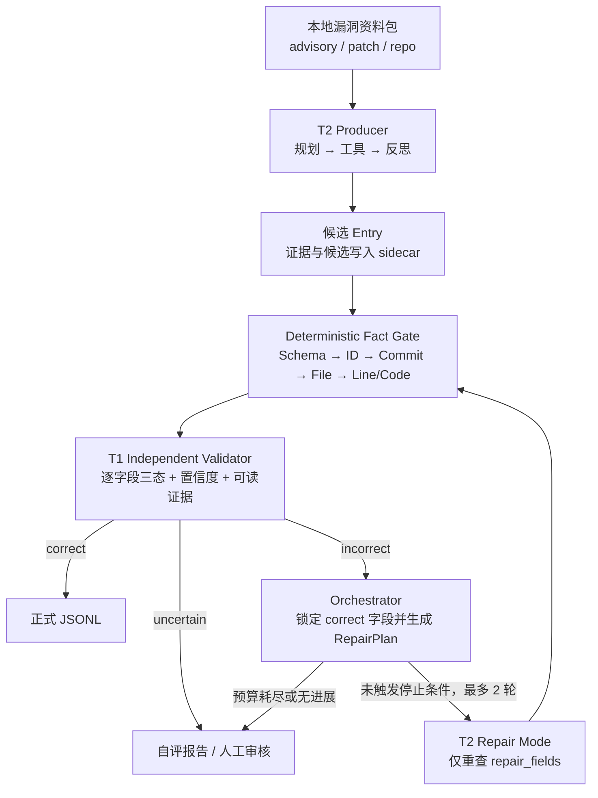

# VulnGym T1 × T2 自动化闭环：B-v2 首版设计

> 状态（2026-08-23）：确定性 T1 基础、受控闭环编排、本地结构化 T2 Producer、离线批处理/replay artifact、benchmark 阶段 A/B、阶段 C sealed source snapshot、D0–D4 source-only 生产/独立复核、无凭据可恢复 replay 制备控制面，以及阶段 E3/E4 的隔离执行、固定批次调度、严格投影和 test-first 20+50 final gate 均已实现。70 题的真实响应配置、专用 native Linux 上的真实 20+50 全量实跑、在线模型接入与全字段确定性 verifier 仍未完成，因此本文不声称最终数据验收已经通过。

## 1. 目标与总体架构

B-v2 用 T2 生产候选，Fact Gate 消除可机械核验的错误，再由与 T2 推理隔离的 T1 逐字段盲审。T1 发现明确错误后，Orchestrator 生成 `RepairPlan`，T2 只重做错误字段；初始候选之后最多自动修复两轮，仍不收敛或证据不足则转人工。



传统 Entry 闭环中的 T1 只接收原始资料包和待审 Entry，不读取 T2 的推理或自报置信度。T2 的 Planner、Semantic Judge 与 Reflection 已有严格 JSON 模型调用边界，并只能引用受控工具签发的候选和证据；这仍不等于全部正式 Entry 字段的语义正确性已经得到证明。D3 已为 source-only 候选实现独立的四准则复核与反证检查，但传统 15 字段 Entry 的完整语义正判和全字段确定性裁决仍待补齐。

## 2. 核心契约

### 2.1 Deterministic-first 与语义边界

硬事实按 `Schema/ID → commit 对象 → 精确路径 → 行号 → ±5 行代码匹配` 执行，失败直接形成结构化证据。通过门禁只代表“事实存在”：commit 存在不证明它是漏洞版本，代码匹配也不证明外部可达性或漏洞语义。因此 `fact_status=correct` 仍可对应 `status=uncertain`，语义必须由公告、patch 和漏洞版本源码交叉裁决。

`critical_operation` 采用双模式：

- **Sink 模式**：面向 XSS、注入、SSRF、路径访问等，从 patch 找危险操作变化，再回到漏洞 commit 确认真正 sink；不得引用修复后新增代码。
- **Guard 模式**：面向鉴权、租户隔离和状态机错误，定位错误/缺失的条件、归属检查或提前返回点。若漏洞版本没有有证据的可落地位置，则转人工，不能虚构行号。

Entry Point 需由路由、RPC/CLI、消息回调或反向调用关系证明“外部可达”。完整 trace 可为空数组，不能为补链而虚构节点。

### 2.2 正式输出、sidecar 与证据

| 边界 | 内容 | 约束 |
| --- | --- | --- |
| `<output-dir>/entries.jsonl` | 已 finalized 的正式 Entry | 仅 15 个 Schema 字段；`verify=0`；只有 `correct` T1 报告闭合的结果才能进入。 |
| `<output-dir>/validation.jsonl` | 正式 T1 报告流 | 保留实际形成的终态报告；与 attempt 级 `validations.jsonl` sidecar 区分。 |
| `<output-dir>/* sidecar` | 内部 replay 记录 | `states/candidates/validations/evidence/tool_calls/model_calls/repair_history/deferred/errors`；不得回流污染 Entry。 |
| `<output-dir>/run_manifest.jsonl` | 数据集闭合清单 | 对所有文件、根记录、数量和 digest 建立一次事务内的闭合。 |

闭环 writer 在同一个 sibling staging 事务中写入并复核 `entries.jsonl`、
`validation.jsonl`、全部 sidecar 和 `run_manifest.jsonl`，成功后才发布此前不存在的
输出目录。输出目录不能与 task、fixture、repo map、资料包或仓库输入重叠。

统一证据模型如下；`line_start`/`line_end` 如出现必须成对且有序：

```json
{
  "evidence_id": "EV-GHSA-001-SOURCE-04",
  "report_id": "GHSA-W7XJ-8FX7-WFCH",
  "source_type": "source",
  "commit": "9942de8011d4b5a141ac507c974c061c0cdad59a",
  "file": "src/lib/components/common/RichTextInput.svelte",
  "line_start": 348,
  "line_end": 348,
  "snippet": "tempDiv.innerHTML = htmlContent;",
  "tool_call_id": "TOOL-00031"
}
```

`source_type` 取 `advisory/patch/source/git/schema` 之一；除 `evidence_id/report_id/source_type/snippet` 外，其余字段可选。`evidence_refs` 只用于追踪；T1 报告仍须内嵌可读证据。正式必填事实拿不到时不伪造 Entry：`vuln_ids`、`trace` 可用合法空数组，其余关键缺失进入人工队列。

### 2.3 离线、只读与预算

证据层默认离线：只读本地公告、patch 和仓库，禁止 HTTP 取数、`git fetch`、答案 API、执行仓库二进制/安装脚本或动态导入目标代码。严格离线配置使用本地模型；若显式启用远程 LLM，只发送最少片段，API Key 不入库、不入日志。

Git 工具用固定参数数组读取 `cat-file/ls-tree/show`，无任意 shell，不 checkout、不运行 hook/diff driver/textconv；校验 SHA 和相对路径，拒绝绝对路径、`..` 与选项/pathspec 注入，并限制超时和 blob 大小。确定性门禁只接受对象库位于授权根目录内的普通 clone/bare repo，拒绝 gitfile、`commondir`、alternate object database 和 `info/grafts` 历史覆盖；固定 `core.commitGraph=false` 使祖先关系回到原始 commit 对象，并以 `GIT_NO_REPLACE_OBJECTS=1` / `GIT_NO_LAZY_FETCH=1` 阻止 replace refs 与 partial clone 隐式联网/写对象。AST 如需展开源码，只能由后续受控工具创建每任务独立临时目录，不能把该目录绕回只读事实门禁。

确定性输入门禁已接入资源上限：默认单行 JSONL 1 MiB、每批 10,000 条、每条 trace 64 节点、每包 64 个文件；对应硬上限为 32 MiB、100,000 条、256 节点和 256 文件。超限在仓库/Git 扇出前形成结构化单条错误，超长行以固定大小缓冲排空。闭环预算默认每任务 `max_llm_calls=16`、`max_tool_calls=80`、`max_repair_iterations=2`；调用开始前计费，失败不退款，事件账本可用于确定性的内部一致性对账。全字段正确、只剩 `uncertain`、两轮耗尽、无变化/错误重复、预算耗尽、改坏锁定字段、原正确字段回归或证据冲突时立即停止。`uncertain` 不会被自动改写，直接进入人工分流。

### 2.4 批处理与 replay artifact 契约

`python -m vulngym_agent.closed_loop_cli` 每个物理 JSONL 行只接受一个严格
`RunTask`：根对象恰好含 `task_id/report_id/entry_id/inputs`；`inputs` 恰好含
`contract_version/input_line/repo_url/package/hints`，其中 `input_line` 必须等于物理
行号。任务不携带本机根目录。受信配置另行提供绝对 `--package-root`，以及结构为
`{"contract_version":1,"repositories":[{"repo_url":...,"path":...}]}` 的严格 repo
map；URL 必须是 canonical GitHub URL，并按精确值映射到绝对本地 repository root。
package root 与所有 repo root 必须互不包含。

当前批处理只提供离线 `ExactReplayBackend`，不包含在线模型 provider。fixture 根对象
恰好含 `contract_version=2/backend_id/model_id/responses`；每个 response 离散保存并核对
完整的不可变 `ModelRequest` 身份：`task_id`、`attempt`、`policy_scope`、`stage`、
`model_call_id`、`backend_id`、`model_id` 与 `request_sha256`，再附
`status/response/error_code`。查找直接使用这组无碰撞字段 tuple，不能用一个调用方提供或
经分隔符拼接的 operation 字符串替代逐字段绑定。fixture 不保存原始 request 或 prompt，
且每组身份必须恰好消费一次；缺失、复用或剩余 fixture 都会使整个 staging 事务失败。
它只是离线测试/复现输入，不是 gold，不代表独立 T1 结论。隐藏验收 gold 必须在物理上
位于 task、fixture、package 与 repository root 之外，并禁止用于准备模型响应。

最小执行示例：

```bash
python -m vulngym_agent.closed_loop_cli \
  --tasks tasks.jsonl \
  --replay-responses replay-responses.json \
  --repo-map repo-map.json \
  --package-root /srv/vulngym/packages \
  --output-dir /srv/vulngym/runs/run-001
```

输出父目录必须已存在，`--output-dir` 本身必须不存在。退出码 `0` 表示无输入/任务
失败；默认允许 `manual_review`。退出码 `1` 表示出现输入/任务失败，或启用
`--require-all-finalized` 后存在人工审核结果；退出码 `2` 表示配置/I/O、task 总字节
超限或 exact replay 闭合等致命错误。task 输入默认单行 1 MiB、总文件 64 MiB、
10,000 条记录，可由 `--max-input-line-bytes`、`--max-task-bytes`、`--max-records`
调整，硬上限依次是 32 MiB、1 GiB、100,000。fixture 默认上限另为 16 MiB 与
50,000 个响应。若 `--max-records` 截断批次并留下后续记录对应的 unused fixture，
exact closure 会使整批拒绝发布；artifact reader/writer 还以 `ReplayLimits` 约束单文件
记录数、单行和总字节。

落盘集合固定包含 `entries.jsonl`、`validation.jsonl`、`states.jsonl`、
`candidates.jsonl`、`validations.jsonl`、`evidence.jsonl`、`tool_calls.jsonl`、
`model_calls.jsonl`、`repair_history.jsonl`、`deferred.jsonl`、`errors.jsonl` 与
`run_manifest.jsonl`。可在不运行 T1、T2、Git 或模型的情况下读取和验算：

```python
from vulngym_agent.orchestrator import (
    read_closed_loop_artifacts,
    verify_closed_loop_artifacts,
)

bundle = read_closed_loop_artifacts("/srv/vulngym/runs/run-001")
manifest = verify_closed_loop_artifacts("/srv/vulngym/runs/run-001")
```

T1 只读原始资料包和正式候选，不读取 model-call sidecar。artifact 不保存 raw model
prompt/response、Producer assumptions、异常文本或配置的本机根目录；model-call 仅保留
可闭合的元数据与 digest。不过 Evidence snippet 和 Entry Schema 要求的代码片段会被
有界保留，因此只应写入公开或已获许可的内容，并将整个目录留在私有仓库或其他受控
位置。digest/哈希链没有签名能力，只能检查内部一致性，不能把 fixture 或 artifact
提升为外部事实来源。

### 2.5 固定公开 benchmark harness（阶段 A/B）

`python -m vulngym_agent.benchmark_cli` 将独立数据生产流程的公开 bundle 接到 B-v2，
但 bundle 不复制进本实现仓库。受信 harness 主机把它作为外部只读目录挂载，并通过
`--benchmark-root` 显式传入。运行时 profile 固定为 `vulngym-50-20-v1`，来源 revision
固定为 `cd69f7e163e08485ab5496115ae03439cda6e27e`，公开 manifest SHA-256 固定为
`d4ef4a663a30a39d2ccd89dc89f70d19a06686ae86179c537cd5139b8ff00a73`。reader 不做目录
发现，只允许读取固定 manifest、record schema、manifest schema、公开 train JSONL 和
公开 test JSONL；profile、revision、artifact digest、Schema 或集合不一致时 fail closed。

六个命令的职责与发布物如下：

| 命令 | 行为 | 原子输出 |
| --- | --- | --- |
| `validate --benchmark-root <external-read-only-root>` | 校验完整固定公开 profile，只在 stdout 返回计数摘要 | 无目录输出 |
| `export-tasks --split train\|test --output-dir <new-dir>` | 导出仅含 task/repo/commit/split/instruction 的无答案源码快照任务 | `tasks.jsonl`、`manifest.json` |
| `project-train --artifact-root ... --bundle-index ... --bundle-index-sha256 ... --output-dir <new-dir>` | 完整校验每题 replay、投影一对多 finding，最后调用公开训练 oracle | `findings.jsonl`、`task_results.jsonl`、`aggregate.json`、`manifest.json` |
| `project-test --artifact-root ... --bundle-index ... --bundle-index-sha256 ... --output-dir <new-dir>` | 完整校验每题 replay 并形成盲测提交；不读 train 文件、不调用 oracle | `findings.jsonl`、`task_results.jsonl`、`manifest.json`；无分数与 `aggregate.json` |
| `project-discovery-train --artifact-root ... --bundle-index ... --bundle-index-sha256 ... --output-dir <new-dir>` | 完整校验每题 D2/D3 三文件结果包，严格执行 D4 → D0，再调用公开训练汇总 | `findings.jsonl`、`task_results.jsonl`、`aggregate.json`、`manifest.json` |
| `project-discovery-test --artifact-root ... --bundle-index ... --bundle-index-sha256 ... --output-dir <new-dir>` | 完整校验每题 D2/D3 三文件结果包并形成 D0 盲测提交；使用独立 test 读取面，不调用训练汇总 | `findings.jsonl`、`task_results.jsonl`、`manifest.json`；无分数与 `aggregate.json` |

D0–D4 结果包的精简投影命令如下；两条命令都要求 index 精确字节的 digest pin：

```bash
python -m vulngym_agent.benchmark_cli project-discovery-train \
  --benchmark-root /srv/vulngym/benchmark-public \
  --artifact-root /srv/vulngym/discovery-results/train \
  --bundle-index /srv/vulngym/attestations/discovery-train-index.json \
  --bundle-index-sha256 <index-file-sha256> \
  --output-dir /srv/vulngym/discovery-projections/train

python -m vulngym_agent.benchmark_cli project-discovery-test \
  --benchmark-root /srv/vulngym/benchmark-public \
  --artifact-root /srv/vulngym/discovery-results/test \
  --bundle-index /srv/vulngym/attestations/discovery-test-index.json \
  --bundle-index-sha256 <index-file-sha256> \
  --output-dir /srv/vulngym/discovery-projections/test
```

所有 `output-dir` 必须事先不存在，且不能与 benchmark、artifact root 或 index 重叠。
发布使用 sibling staging 和 no-replace rename，失败时不暴露半成品。训练 oracle 的
`aggregate.json` 只包含总数、命中数、recall 与提交 finding 数，不输出 task、advisory、
Entry 身份或逐项匹配。test 专用 reader 只打开固定 manifest、两个 Schema 与 test JSONL，
不会触碰公开训练答案。

投影前必须由受信评测端提供严格 bundle index 及其精确文件字节 SHA-256；CLI 的
`--bundle-index-sha256` 没有默认值。index 根对象和数组项都拒绝额外键：

```json
{"bundles":[{"dataset_sha256":"<64-lower-case-replay-dataset-sha256>","task_id":"VG-TEST-<20-UPPER-HEX>"}],"contract_version":1,"manifest_sha256":"d4ef4a663a30a39d2ccd89dc89f70d19a06686ae86179c537cd5139b8ff00a73","profile_id":"vulngym-50-20-v1","split":"test"}
```

`bundles` 必须与选定 split 的 task 集合精确相等：每题一次、不得缺少或增加，task ID
与 `dataset_sha256` 都不得重复。传统 Entry 命令的 digest 绑定
`<artifact-root>/<task_id>` 下的一份完整 closed-loop replay 数据集；discovery 命令的 digest
则绑定下节定义的逐题三文件结果包。reader 会在投影前核对对应固定文件集合、引用/分支
闭合、计数、资源上限与预期 dataset digest；所有 bundle 都完成后才允许训练汇总或发布。
这些 SHA 能证明“读到的字节与受信调用方给出的预期值一致”并发现损坏，却不是签名，
不能证明源码快照、fixture、公告或模型判断的来源真实性。

传统 Entry 投影按 task 的 `repo_url + commit` 重新绑定，支持同一源码快照输出多个
finding，对等价端点稳定去重；每题默认 Top 64，`--top-k` 硬上限为 256。discovery
路径先以 D0 固定权限完整投影最多 64 个 finding，再做稳定的 `--top-k` 截取，因此该命令
的取值只能是 1..64。公开训练 oracle 固定使用 official inclusive 行号容差 5。训练 gold
只在 finding 已跨过 Producer/投影边界后由 aggregate oracle 使用，绝不能转换成
`RunTask`、hint、fixture、D0 task 或候选。

阶段 A/B 解决公开离线数据契约与结果投影，阶段 C 解决源码交付边界。原有
`LocalStructuredT2Producer` 仍是依赖公告、fix commit 与显式 source hints 的传统 Entry
链路；D0–D4 则以独立的 source-discovery producer/reviewer 实现纯源码多候选路径。
最终验收前置条件 **E：隔离 50/20 运行** 已完成 E3 单题 OCI 竖切，尚缺 E4 批次调度与
native Linux 50/20 门禁——必须在逐题进程隔离、断网、严格只读输入和 gold 物理隔离的
环境中执行，再由独立 evaluator 汇总验收。

### 2.6 Sealed source snapshot（阶段 C）

阶段 C 把“受信 Git 对象库”与“Agent 可读源码”分成两个安全域。受信 preparer 可读取
完整本地 source repo，但必须按无答案 task export 指定的精确 `repo_url + commit` 解析
commit 及其 root tree；它只物化该 tree 中 policy 允许的 source blob 到
`bundles/<task_id>/tree`。发布树没有 `.git`、父提交、future fix 或 object database。
Git mode `120000` 的 symlink blob 会按固定 policy 安全地物化成一个不可执行的普通文件，
文件内容就是精确 link-target bytes；manifest 绑定原 Git mode 与这一表示，绝不在宿主机
创建 symlink。宿主机 symlink、junction/reparse point、Gitlink/submodule、LFS pointer、
空目录、不安全路径、大小写/前缀碰撞，以及 shallow、alternate、graft 等不受支持的 Git
存储条件都会拒绝。

每题 `control/manifest.jsonl` 是严格 canonical JSONL。header 绑定 task ID、精确 repo URL、
commit、root tree OID 与固定 policy；file record 绑定相对路径、Git mode、blob OID、
字节数与 SHA-256；footer 绑定逐项内容根和汇总量。`control/attestation.json` 使用
HMAC-SHA256 对 manifest 精确字节及 key ID 做域分离认证。外层批次 manifest 再绑定
profile/schema/split、公开 manifest digest、`tasks.jsonl` digest、source-map digest、
全部 task snapshot manifest/content root 和总量，外层 HMAC 同样绑定 key ID。HMAC 只在掌握评测密钥的受信域内提供
完整性与预期字节绑定；它不是公开可验证的来源签名，也不提供非否认或外部事实真实性。

source-map 是独立、严格、canonical 的受信配置，`sources` 必须按 repo URL 与 commit
排序，并以精确 `(repo_url, commit)` 集合覆盖 task export，不能缺少、增加或重复；每项
只把该身份映射到一个 canonical absolute `repo_root`。`prepare` 必须同时取得 task JSONL
与 source-map 精确文件字节的 SHA-256 pin，以及固定 public profile manifest digest，避免
目录发现或调用方默默替换输入。`verify-batch` 则必须取得 sealed batch manifest 的精确
SHA-256、同一 HMAC key 和
预期 key ID，并深度复验外层布局和每题 tree：

source-map 由受信的 `source_acquisition_cli prepare` 从一至两个已验证 answer-free task
export 机械生成，不要求操作员手写 URL 或 commit。它只接受 canonical GitHub HTTPS
identity，按 `<store>/<owner>/<repo>.git` 建立互不共享对象的 bare SHA-1 repository，并把
每个精确 commit 固定在 `refs/vulngym/<commit>`；fetch 禁止 shallow、filter、alternate、
worktree 与交互式凭据提示，随后执行 storage checks、ref/cat-file 闭合和
`git fsck --full --strict`。默认 HTTPS；受控网络必须使用 SSH 时，只能通过
`--github-transport ssh --ssh-executable /usr/bin/ssh` 将已验证 HTTPS identity 派生为固定
GitHub SSH transport，并强制 BatchMode/no-prompt/host-key checking、忽略 ambient 用户 SSH
配置且禁用 ProxyCommand/ProxyJump，不能接收任意 SSH URL。

```bash
python -m vulngym_agent.source_acquisition_cli prepare \
  --repository-store /srv/vulngym/repos \
  --output-dir /srv/vulngym/source-controls \
  --git-executable /usr/bin/git \
  --github-transport ssh \
  --ssh-executable /usr/bin/ssh \
  --test-task-export-dir /srv/vulngym/exports/test-tasks \
  --test-expected-tasks-sha256 <test-tasks-jsonl-sha256> \
  --train-task-export-dir /srv/vulngym/exports/train-tasks \
  --train-expected-tasks-sha256 <train-tasks-jsonl-sha256>

python -m vulngym_agent.source_acquisition_cli verify \
  --repository-store /srv/vulngym/repos \
  --output-dir /srv/vulngym/source-controls \
  --git-executable /usr/bin/git \
  --github-transport ssh \
  --ssh-executable /usr/bin/ssh \
  --test-task-export-dir /srv/vulngym/exports/test-tasks \
  --test-expected-tasks-sha256 <test-tasks-jsonl-sha256> \
  --train-task-export-dir /srv/vulngym/exports/train-tasks \
  --train-expected-tasks-sha256 <train-tasks-jsonl-sha256>
```

输出的 acquisition report 不含宿主机路径，逐 commit 记录 root tree、tree mode、
symlink/gitlink/LFS、资源上限、扫描完整性和稳定状态码；source-map 因包含 canonical
absolute repo path，其 digest 必然与平台/部署路径绑定。fetch/fsck 成功不等于 sealed-ready：
report 与 CLI summary 都闭合 `ready_task_count/blocked_task_count`；有 policy-blocked commit
时仍发布诊断控制文件，但 CLI 返回 10，禁止自动化误把“取源成功”解释成“可制备”。输出
采用 no-replace 发布；提交点后若 readback/identity 不确定，返回 `publication_uncertain`
（status 5）并保留 destination，调用方只能做精确 `verify`，不能按路径名回滚或清理。

```bash
python -m vulngym_agent.snapshot_cli prepare \
  --task-export-dir /srv/vulngym/exports/test-tasks \
  --expected-tasks-sha256 <tasks-jsonl-sha256> \
  --expected-public-manifest-sha256 <public-manifest-sha256> \
  --source-map /srv/vulngym/source-controls/test-source-map.json \
  --expected-source-map-sha256 <source-map-file-sha256> \
  --output-dir /srv/vulngym/sealed/test \
  --key-file /srv/vulngym/secrets/snapshot-hmac.key \
  --key-id evaluator-snapshot-v1

python -m vulngym_agent.snapshot_cli verify-batch \
  --sealed-root /srv/vulngym/sealed/test \
  --expected-manifest-sha256 <sealed-batch-manifest-sha256> \
  --key-file /srv/vulngym/secrets/snapshot-hmac.key \
  --expected-key-id evaluator-snapshot-v1
```

preparer 在一个 sibling staging 中完成全部任务：每题先生成并完整校验，外层 manifest
闭合后再逐题完整校验一次，最后以一次 no-replace rename 发布整批；任一题失败都不会
发布半批结果。固定批次上限为 100 个 task、1,000,000 个文件、1,000,000 个路径节点和
16 GiB 文件内容。Linux 的 `renameat2(RENAME_NOREPLACE)` 与 Windows 针对 staging
directory handle 的 rename 分别是提交点，也是当前支持的两个发布平台；其他 POSIX
系统会明确拒绝而不会降级到非原子发布。提交点成功后若 destination identity、parent
identity 或 durability 无法确认，会返回 `publication_commit_uncertain`（单题层相应为
`snapshot_publication_uncertain`）；调用方须把目标视为可能已提交，并用预期 manifest
重新校验，绝不能依赖可能已被并发替换的路径名做回滚或删除。

运行 Agent 时，evaluator 只把单题 `tree/` 以只读 mount/ACL 交给该任务；同一 sandbox
只再提供一条无答案 task 和有界输出位置，并关闭网络。`control/`、HMAC key、source repo、
其他 task tree、benchmark 仓库、训练 split、生成器输入、评测日志与 gold 都不可见。
因此阶段 C 证明的是“Agent 读取到的 source-only 字节与受信 preparer 所选 Git 对象一致”，
并不提供发现或语义正确性结论；后者由独立的 D0–D4 组件链路承接。

最终盲测的评分真值必须物理隔离在独立评测端存储中。每个 Producer sandbox 只挂载一条
无答案任务、该题 sealed tree 与有界输出位置；不得挂载 benchmark 仓库、训练 split、
原始数据/生成器输入、评测日志或评分材料。trusted evaluator 在 Producer 退出后再读取
公开 test 契约和已闭合 replay 进行投影，评分进程与 Producer 也必须分离。

### 2.7 Source-only D0–D4 组件链路

D0–D4 已在进程内组件层贯通，但不代替阶段 E 的运行环境隔离：

1. **D0 契约与投影**：`DiscoveryTaskInputV1`、`DiscoveryCandidate`、
   `DiscoveryReview` 与 `DiscoveryTaskResult` 是严格 canonical、无宿主机路径的公开边界。
   `project_discovery_result` 只输出经 review 标记为 `emit` 的候选，固定权限为每题最多
   64 个 finding。
2. **D1 只读工具面**：`DiscoveryToolbox` 只持有一题的 `BoundSealedTree`，不暴露树的
   宿主机路径、HMAC key、Git 仓库/历史、shell 或网络。inventory/read/search/structure/link/
   source-validate 均受固定预算约束，产生的 artifact/node capability 与 task、snapshot、
   上游 digest 闭合。
3. **D2 多候选 Producer**：`SourceDiscoveryAttemptController` 让模型只选择 runtime 签发的
   不透明 ID；controller 机械构造 D0 candidate、复验源码位置和 evidence closure，并为每个
   candidate 生成 validation receipt。D2 的固定上限是 32 个候选；无法形成完整 draft 时
   输出整题 `ProducerDeferredV1`。
4. **D3 独立 Reviewer**：只有 D2 形成 draft 才会延迟创建 D3。Reviewer 使用重新获取的
   tree、budget 与 context，由编排层单独注入 D3 backend，不读取 D2 推理，并对
   `entry_role`、`critical_role`、`trace_continuity`、`counterevidence_status` 四项分别
   给出 `supported/contradicted/insufficient`。D2 与 D3 的 tree/budget capability 必须为
   不同实例，且各自在边界处闭合。
5. **D4 严格适配**：`project_discovery_run_v1` 要求 D2 task、D3 内嵌 draft 与最终结果逐字节
   规范化后精确绑定；D2 defer 不得带 D3，D2 draft 必须恰好带一个 D3 结果。只有 D3
   `accept` 映射为 D0 `emit`；`reject/defer` 保持对应决策，整题 defer 不携带部分候选。
   `SourceDiscoveryRunV1` 同时保存 D2、可选 D3 与唯一可重算的 D0 结果。

每题离线结果包固定只有 `producer.jsonl`、`reviewer.jsonl`、`manifest.jsonl` 三个文件。
writer 在 sibling staging 内写入、fsync、完整读回校验后，以 no-replace rename 提交；reader
核对固定布局、canonical JSONL、资源上限、task/dataset digest 与分支形状，并重新执行 D4，
不信任持久化的派生结论。提交前失败时，所有平台都保守保留私有 staging，绝不执行
name-based unlink/rmdir：即便 POSIX descriptor-relative 的 stat-then-unlink 也存在成员名
替换窗口。提交点后任何 identity、durability 或最终读回失败统一返回
`publication_uncertain` 且标记 committed；调用方必须把正式目标视为可能已提交，以预期
task ID 和 dataset digest 调用 `read_discovery_result_bundle` 复核，不能按路径名回滚。

reader 返回的是与本次实际读取字节闭合的内存快照，不是对路径永久不变的承诺；有限次
stat/readback 也不能替代操作系统级写排他。受信 evaluator 必须在校验/投影期间提供独占
读取或只读 mount/ACL；把该边界强制到其他进程正是阶段 E 的职责。

benchmark harness 的 discovery 路径会先校验所有已索引任务包，再对每题按固定 64 上限
完成 D0 投影，最后才按 1..64 的 `--top-k` 稳定截取和一次性发布。训练路径随后调用只返回
总量/recall 的 aggregate；测试路径使用独立 test reader，不加载公开训练答案、不调用训练
aggregate，也不输出分数或 `aggregate.json`。

#### 2.7.1 无凭据的 ordered replay 制备控制面

正式 D2/D3 请求不是可预先静态枚举的模板：下一次 payload 会包含前一次工具动作签发的
opaque artifact/node ID、catalog 和 last result，因此 70 题的真实配置必须逐题运行当前
sealed tree 后再决定。`replay_authoring_cli` 为此提供受信但不含在线 provider 的单题恢复
循环：它读取调用方以 exact wire SHA-256 固定的 canonical `DiscoveryTaskInputV1`、已认证
sealed bundle/key 以及只含 `d2.json`、`d3.json` 的草稿，从头确定性运行生产 controller。
已有响应由正式 `OciReplayConfigV1` reader 重建；第一次 `replay_miss` 被转换成唯一的
path-free pending contract，固定 `task_id/role/stage/payload/request_sha256`、该请求在当前
role transcript 中的一基 occurrence，以及当前 prefix config semantic digest，不输出宿主路径、
密钥或额外运行日志。相同 stage/payload 的请求可以在一次合法动态流程中重复；ordered
transcript 的位置、occurrence 和 prefix digest 共同区分它们，先前 occurrence 的 envelope
不能重用于后一次。

外部人工或 Agent 只能提交与该 pending 精确绑定的 strict structured response envelope；
response body 及其 digest、task、role、stage、request digest、occurrence 和 prefix digest
全部规范化复核。preparer 先把候选 response 放入内存中的 prospective pair，再从头运行；
过期绑定、controller 结构拒绝、错序或未消费 response 都在写盘前失败。通过后只用同目录
临时普通文件和 `os.replace` 原子延长对应 role 草稿，并立即按正式 reader 读回。API 在运行
前后检查 sealed/draft 的稳定目录及父链 identity、精确两文件 membership，并拒绝 sealed、
draft、publication 之间的相等、祖先/后代和现存 inode alias；CLI 边界再隔离 task/key/response
文件。中断后重新执行
`next-request` 会从 canonical pair 重放，得到同一个下一请求；无需保存进程状态、provider
session 或凭据。

草稿替换前失败会清理本次临时文件并保持原字节；publication staging 在提交前失败也必须
清理。`os.replace` 之后的 fsync、目录扫描、reader readback、identity 复核或 reload 任一步
失败都统一报告 `committed=True` 的 `update_uncertain`，不能伪装成未提交。CLI 不输出异常
路径或 traceback，stdout/flush、`KeyboardInterrupt`、snapshot/path 拒绝均映射到固定错误码；
exit 11 表示调用方必须先按 config/wire digest 读回确认，不能盲目重试。

闭合时 preparer 再用生产 `ReplayStructuredModelBackend` 纯离线执行并要求 exact closure，
然后把两份 canonical config 发布到一个新目录。backend 把 config 视为 invocation transcript
而不是 request dictionary：非空配置必须逐项、按序、恰好消费一次；miss、错序、额外调用
或 unused suffix 均拒绝 worker 成功；Replay backend 子类也由基类 closure protocol 强制
检查，不能覆盖方法绕过。D2 defer 时 D3 必须为空。闭合 summary 明确暴露
`run_outcome`（`d2_deferred`/`d3_deferred`/`finalized`）以及 candidate、finding、reviewer verdict、
accept/reject/defer 计数，供上层 receipt/gate 机械判定实际运行结果。

`validate_formal_replay_pair_v1` 只验证两个 canonical、任务/角色/backend/model 绑定正确且
D2、D3 transcript 均非空；它是正式非 smoke 输入的最低静态形状，不声称质量达标。
`validate_empty_smoke_replay_pair_v1` 则只接受两个空配置，显式与正式路径分离。空配置仅允许
“惰性分支零调用”或“首次请求 miss”两种兼容闭合；它能验证 E3/E4 管线，却不能替代有意义
的 70 题响应和真实质量门禁。正式发布仍须结合 summary/独立 receipt 拒绝 defer、零 finding
或其他不满足验收策略的 outcome。

该控制面刻意没有网络、SDK、provider 命令或 API key 参数。实现者/批评者/审查者 Agent
可以在控制面之外协作产生 response body，但它们不能绕过 sealed source capability、固定
controller、prospective run、原子草稿更新或最终 exact replay。70 题批量 manifest 仍由 E4
现有严格 loader/plan 生成与绑定；本控制面只负责逐题形成可恢复、可审计的合法 config pair。

### 2.8 E3 固定 Linux OCI 单题运行闭环

E3 已实现一条固定的离线 replay 单题竖切，用来证明 D0–D4 能在真实 Linux OCI 边界内
运行；它还不是 50/20 批次调度器。受信 evaluator 先绑定 Docker CLI 的实际文件字节、
Linux daemon 身份、精确基础镜像 ID 与整份 execution policy。任务数据不能选择镜像、
命令、entrypoint、mount 目的地、backend/provider 或资源参数。容器命令只有
`materialize` 与 `execute` 两种固定形式，worker 只使用标准库和仓库内固定模块，模型响应
来自显式绑定的离线 replay 配置。宿主侧 Docker CLI transport 同时限制 stdout/stderr、
wall time 与完整进程树：Linux 使用独立 process group，Windows 在进程恢复执行前先加入
kill-on-close Job Object。

交接不使用普通 named volume。evaluator 不直接修改或挂载原始 0700/0600 sealed tree，而是
在 evaluator 独占的 0700 父目录中，以有界流式复制、逐级 no-follow/openat、完整 identity、
SHA-256 和 handoff 清单校验生成一次性输入；仅把子目录/文件降为 0555/0444 供固定非 root
UID 读取。materializer 以非 root 身份、断网、drop-all capabilities、no-new-privileges 和
固定资源上限启动，只把该 source 副本与四份 runtime wire 副本递归只读挂载到 `/input-*`，
并将规范化 generation 写入自身唯一允许变化的 `/vulngym` 容器层。materializer 退出后、
receipt 校验和派生镜像提交前，evaluator 再次核对 staging identity/内容与原始 sealed tree；
任何漂移或无法确认的权限恢复/清理都 fail closed。
退出后 evaluator 要求 rootfs diff 只包含该 generation，随后以固定 argv、无 tag 的方式把
停止容器提交为带唯一所有权 label 的内容寻址派生镜像，并核对其基础 RootFS layer 前缀、
唯一新增 layer、Config 与精确 image ID。execute 容器从该派生 ID 启动，不挂载 source、
runtime 或其他数据卷；两个 bind 目标只保留为空的、非挂载点目录。rootfs 全只读，
`/tmp` 是 `rw,nosuid,nodev,noexec` tmpfs。
因此宿主机原始 tree/runtime 即使随后变化，也不会改变 worker 实际读取的 generation。

execute 启动前后都严格检查完整固定配置、无附加网络/设备/权限面和 clean terminal state；
worker 还从 `/proc` 复核 uid/gid、PID namespace、capabilities、no-new-privileges、seccomp、
rootfs/tmpfs mount 属性及固定字面地址不可连接，并对 source/runtime/rootfs 做实际写失败
探针。execute 的 image filesystem diff 必须真正为空。完成顺序固定为删除 execute
container、materializer container、派生 image 并逐项确认；任何创建/提交/删除身份不确定都
返回 `cleanup_uncertain`，不能签发成功证据。

`RuntimeEvidenceV1` 是 success-only canonical 契约：同时绑定基础镜像、派生 generation
镜像、Docker server/CLI、execution plan/policy、handoff、materializer create/inspect/diff、
execute create/inspect/diff、资源上限、run wire、退出状态和 cleanup。receipt 内嵌整份证据
而不只携带调用方给出的摘要；supervisor 只接受一次性 provider completion。哈希仍不是
签名。evaluator Python 进程及其代码、专用 Docker daemon/socket、基础镜像和宿主内核属于
受信计算基；拥有该 daemon 控制权者等价于 evaluator 管理员，不在同批次的不受信模型内。
若未来允许第三方插件进入 evaluator 进程，必须先把 provider 移到独立进程/服务并采用可
验证的签名或认证通道，不能把 Python 私有名称或 token 当作进程内安全边界。

Docker Desktop 仅用于可信单用户开发烟测；Windows `chmod` 不被视为 DACL 隔离证明。
正式发布门禁仍须在专用 native Linux runner 上使用独占 daemon/socket，验证
cgroup/namespace/seccomp、POSIX staging 权限与异常清理路径。在 native Linux 50/20 门禁
完成前，仓库不声称通过最终 50+20 验收。

### 2.9 E4 固定批次调度与 test-first final gate

E4 的可信调度与交付面已经闭合，但尚未完成正式 20+50 实跑。batch-wide execution policy
只绑定共同的 backend/model、预算、隔离、资源和 runtime；每题 D2/D3 replay 的 semantic
SHA 与 exact wire SHA 则直接进入 `DiscoveryTaskExecutionPlanV1`。batch plan 按 sealed batch
顺序内嵌全部 task plan 并整体哈希，因此它本身是唯一执行授权索引，不依赖第二份可漂移的
lookup。外部 replay input manifest 只负责以 content/wire 双 pin、固定目录布局、no-follow
regular-file 读取和首尾 identity 复验，把 50 或 20 组实际 canonical config bytes 安全加载
进 supervisor；manifest 不能单独授权执行。

调度器固定 `max_parallelism=1`、`max_attempts=1`，只按 plan 顺序逐题 claim 一次 launch；
launch 本身还会在 provider 入口、任何 staging/container 副作用前原子消费，因此已领取对象
也不能被重复调用来产生多个真实 OCI attempt。provider 返回 success completion 后仍须重新核对 CLI/daemon/base image，才允许 supervisor
claim completion。只有固定 allowlist 内、`cleanup_complete` 且 runtime fresh reverify 成功的
单题失败可以继续后续题；`cleanup_uncertain`、runtime identity 漂移、未知 provider/supervisor
异常都会立即毒化整批，剩余题标记 `not_run`。存在干净失败时仍会 fresh post-verify sealed
batch，但只签发独立、不可发布的 canonical attempt report。全量成功时，runner 才签发一次性
E4 publication authority；同一外层 staging/rename 事务除 artifact index、bundles、plan 与 E3
execution receipt 外，还写入 `e4-success-receipt.json`。该成功收据固定绑定 scheduler version、
串行度 1、attempt 上限 1、逐题 cleanup 后 runtime reverify、最终 snapshot reverify，以及按 plan
顺序排列的 run/result/evidence hashes。直接调用低层 E3 publisher 得到的四文件目录不会被当作
正式 E4 成功。batch receipt 还要求同批 Docker/基础镜像身份一致，且逐题派生镜像、容器、
generation 与 runtime-config 身份不得复用。

已提交 execution package 有独立 reader：它只接受调用方给出的 E4 semantic/wire 双 pin，
复核固定五文件根与完整任务目录成员，严格读取 E4/E3 receipt、plan 和 artifact index，再从每题
三文件包的同一 byte snapshot 重建 canonical `SourceDiscoveryRunV1`，逐层核对 run semantic、
run wire、D0 result 与 dataset digest；首尾还复核整棵物化 identity 和父链。旧的 D0-only
bundle reader 保持兼容，但由 richer reader 的同一次读取结果内存降级，不会二次读取路径。

单 split driver 与 CLI 固定接受 20 test 或 50 train，不暴露 backend/model、资源、并行度、
attempt 次数或 top-k 调节面；它们先完整验证 sealed batch、replay manifest 与 prepared plan，
再允许探测 OCI runtime。外层 final-gate plan 把 test/train 两组 sealed/replay/key pins、固定
execution policy、`top_k=64` 与 `test execution → test projection → train execution → train
projection` 顺序整体哈希。

final-gate runner 只在最终输出同一父目录的 0700 隐藏 staging 中产出两个 split。test 的 E4
committed reader 和无 oracle projection reader 全部闭合后才创建 train 子树；随后 training
projection 必须用受信 benchmark root 重算 aggregate。成功树固定为顶层 plan/receipt 与
`test|train/{execution,projection}`，最终只有一次 no-replace root rename。发布前、rename 紧邻
前及最终名独立读回后，会比较控制文件、root/split 结构和四个有界 inner tree 的物化身份；
实际 task plan 还会反向重建 ordered replay manifest 并核对 semantic/wire 双 pin。提交点后的
任何 durability、identity 或读回失败只会报告 committed uncertainty，绝不按名字回滚。

独立 final-gate reader 必须由调用方提供 receipt semantic/wire 双 pin；它严格按 test-first 顺序
重跑两个 E4 committed reader 和两个 projection reader，test 明确不接触 benchmark oracle，
train 明确重算 aggregate。这里的 `status="closed"` 只表示机械绑定闭合，不代表质量阈值或
盲测成绩通过。仍缺的是专用 native Linux 上真实 20 test + 50 train mandatory gate。

## 3. 交付边界与实施状态

### Standard 与 Bonus

B-v2 的 Standard 包含：T1 全核心字段三态、可读证据、多源与批处理；T2 全必填字段、漏洞/fix commit 区分、真实代码位置和 Entry/Critical 语义；以及基础 Guard、Fact Gate、两轮修复、错误隔离和离线安全。B-v2 将题目加分方向中的 Guard 与 T1×T2 联动提升为 Standard。

Bonus 后置为完整 trace、多语言 AST/轻量数据流、系统性错误归因、复杂 merge/backport、完整 taint 与自动发布。Standard 不建设第三个 Repair Agent、通用平台或远程 Artifact Store。

### 当前已实现：传统闭环、隔离源码交付、D0–D4、E3 与 E4 final gate

- 三份严格机器契约：Entry、Validation、Evidence Schema；`additionalProperties=false`，并有 `EvidenceItem`、`FieldValidation`、`ValidationReport` 可序列化模型。
- `SchemaAdapter` 覆盖 15 个正式字段、额外/缺失字段、行范围、GHSA URL 与 `report_id` 一致性、ID 大写/去重/CVE-before-GHSA 排序及正式 T2 的 `verify=0`；它不会补造内容字段。
- `LocalEvidencePackage` 支持每行 `{"package": {...}, "entry": {...}}`，在显式只读根内读取必填公告和可选引用/patch。它拒绝绝对路径、盘符/UNC、`..`、反斜杠、控制符、符号链接、junction/reparse point、重复路径和越界输出；默认单文件/单包/文件数上限为 8 MiB、32 MiB、64，并记录原始字节 SHA-256。加载前后核对完整父链 identity；POSIX 支持时逐级使用目录句柄与 no-follow 打开，Windows 额外核对已打开句柄的最终内核路径。原始 Entry 行继续兼容。
- 公告事实层只提取正文中出现的 GHSA/CVE 和显式标注的 fix commit；`report_id/source_link/vuln_ids` 可与本地公告独立核对。缺公告、不可读或歧义返回 `uncertain`，明确错配与危险资料路径返回 `incorrect`。
- 只读 `GitRepository` 除对象/路径/源码外，已支持全部父提交、祖先关系、历史完整性判断和有界的进程内 UTF-8 unified diff；仍不执行 checkout/fetch/hook/textconv/diff driver。`CommitTransitionValidator` 能明确拒绝 candidate==fix、非祖先和声明路径未变化；正向拓扑/diff 事实仍不冒充漏洞语义证明。
- `T1DeterministicValidator` 已将公告与 Git 历史事实接入字段级报告；无法读取的可选 package 文件通过 `evidence_package=uncertain`、闭合 Evidence 引用与 `missing_information` 明示，不会静默丢弃。`python -m vulngym_agent` 支持 JSONL 逐行错误隔离、单仓库或 `repo_url → 本地路径` 映射，并原子写出 `validation.jsonl`、`evidence.jsonl` 与 `run_manifest.jsonl`。
- `PatchAnalyzer` 有界解析 Git 或本地 unified diff，输出 changed files/hunks、added/removed 坐标、Guard/early-return/removed-dangerous-call 词法候选、冲突与未决项；本地 patch 可与同一路径的不可变 Git diff 交叉核对。解析事实与漏洞语义分开，`semantic_status` 固定为 `uncertain`。
- `CriticalOperationResolver` 以 Sink/Guard 双模式核对候选是否位于漏洞 commit 的真实源码及 fix diff 的 removed/replaced side。fix 新增 Guard 只作为旧版控制流缺口线索，不会被转换为漏洞版本位置；即使事实完全吻合，最终角色仍为 `uncertain`。
- `EntryPointSearcher` 只读取调用者显式提供的不可变 Git blob，支持 Python、JS/TS、Java、Go、Ruby、PHP 的 route/RPC/CLI/handler/export 结构线索，并执行文件数、总字节和候选数预算。它不枚举仓库，也不声称运行时可达性或到达 Critical 的调用图已经证明。
- `T1DeterministicValidator` 已组合以上三层：Patch 解析失败被隔离到单条记录，字段仍保留可读证据与完整 evidence refs；结构事实绝不把 Entry/Critical 字段提升为语义 `correct`。以上仍是确定性 T1 基础设施，不是完整的语义 T1。
- `T2TaskInputV1` 是严格、版本化、无本机路径的任务契约。公告/patch 相对路径、规范化 GitHub URL 和有界 hints 都视为不受信任务数据；本地资料根、仓库映射、模型后端和凭据只存在于受信进程配置中。
- `ProducerExecutionContext` 由 Orchestrator 持有的 attempt controller 签发，`LocalT2ContextFactory` 才能把无路径任务绑定到受信本地根、固定工具注册表和模型后端。Producer 不能自行扩大工具 allowlist、伪造调用记录或绕过工具/模型预算；调用记录与预算事件按 task、attempt、policy scope 和事件序号闭合。
- `RunTask`、`ProductionOutcome` / `ProductionDeferred`、`ToolCallRecord` / `ModelCallRecord`、`RepairPlan`、`Budget` 与 sanitized `RunState` 已形成严格契约。无法建立唯一证据、模型拒绝、预算不足或契约/工具失败时产生显式 defer，而不是拼出部分 Entry。
- `RepairPlan` 对 repair/dependent/locked 字段做完整分区，并以 canonical SHA-256 锁定不可改字段。版本化 repair tool policy 对各字段给出固定 `required_checks` 与 `allowed_tools`：工具权限只能收窄，必需检查不能删减；空 allowlist 明确表示 deny-all。任何缺少受信验证器或权限的必需检查都 fail closed 为 defer。
- `LocalStructuredT2Producer` 已支持离线读取真实本地 Git 对象的 generate 流程：严格任务 → plan → 公告/仓库/fix-parent/diff 事实 → 有界候选 → semantic judge → 15 字段 Schema → reflection。模型只能在工具签发的候选 ID 中选择位置，`verify` 固定为 `0`；歧义 fix、非唯一父提交、缺失 source diff、Guard 无法落到漏洞版本等情况都会 defer。
- 受限 repair 已支持标题、分类等有界字段，并实际执行当前可用的任务、公告与 Schema 检查；其中 semantic check 仍是受限模型判断，不是最终 T1 正判。repair 只能采用 RepairPlan 中 T1 已给出的 `suggested_fix`，只能修改获批字段，且必须保持任务身份与 locked 字段；源码位置、patch 区域、祖先和 trace 连续性等尚无专用全字段 verifier 的检查不会被当作 prompt 文本“默认通过”。
- `ClosedLoopOrchestrator` 同时支持 FakeT2 回归测试和上述真实 Producer 接口：每轮创建全新 T1，仅传原始任务与正式候选；初始候选后最多修复两轮、最多验证三次。它拒绝越权改锁字段、无变化、错误重复、原正确字段回归、调用/预算对账不闭合及跨轮 sidecar 冲突，所有停止原因进入 Schema-valid 状态快照。
- `closed_loop_cli` 已把严格 `RunTask` JSONL、受信 package/repo 配置、离散绑定完整 ModelRequest 身份的离线 fixture、逐行错误隔离与真实 Producer/Orchestrator/T1 串成有界批处理；`--require-all-finalized` 可把人工审核收紧为非零退出。
- replay writer 已以单次 staging 事务发布正式 Entry/Validation、全套 attempt sidecar 与 manifest；reader 会核对固定文件集合、canonical JSONL、引用拓扑、计数、digest、路径和资源上限，`verify_closed_loop_artifacts` 还可与调用方提供的期望事件流做逐文件精确对比。
- `benchmark_cli` 已完成阶段 A/B：固定 public manifest/revision 的外部只读 bundle 校验、无答案 snapshot task 导出、严格 attested replay index、正式 Entry 到一对多 finding 的 Top-K 投影、train-only aggregate oracle 与 test 无评分发布。test 投影有独立 read surface，不加载公开训练答案。
- `snapshot_cli prepare|verify-batch` 已完成阶段 C：按精确 source identity 从受信 Git 对象生成不含历史面的单题 tree，以逐文件 Git OID/SHA-256、canonical manifest 和 HMAC 绑定，再通过两轮逐题复验与一次外层事务发布/复验形成 sealed batch。Agent 消费端的只读单题 mount/ACL 与断网仍由阶段 E 的运行环境强制。
- D0/D1 已完成严格 source-discovery 契约、固定 64 finding 权限、确定性投影，以及只在单题 `BoundSealedTree` 上工作的有界工具面；宿主机路径、密钥、Git 历史、shell 与网络均不进入该能力面。
- D2/D3/D4 已完成 source-only 多候选 Producer、重新获取独立 tree/budget/context 的四准则 Reviewer、惰性分支编排与严格适配。D2 draft 上限为 32；D2 defer 不启动 D3；只有精确绑定的 D3 `accept` 才进入 D0 `emit`。
- 单题 replay authoring 已能在不接入在线 provider 的情况下从 sealed bundle/key 确定性重放到首个 miss，输出 request/digest 绑定的 canonical pending，严格接收一个 response 后 prospective 执行并原子延长 D2/D3 草稿；闭合和正式 worker 都要求非空 replay 按调用顺序恰好消费，D2 defer 强制 D3 为空。它尚未生成 70 题真实 response，空/defer 配置只算机械 smoke。
- discovery replay 已以固定三文件结果包闭合 D2/D3 与可重算 D4；提交前失败保守留下私有 staging，提交后不确定统一以 `publication_uncertain` 交由 digest 复核。`project-discovery-train|test` 已接入 harness：先完整 D0(64) 再稳定截取，test 使用独立读取面且不调用训练汇总。
- E3 已完成固定离线 replay 的 Linux OCI 单题竖切：原始 sealed tree 保持 0700/0600 不变，evaluator 在私有父目录中生成并双向核验只读 source/runtime staging；生成内容通过 materializer 容器层提交为内容寻址派生镜像，execute 无 source/runtime/volume mount、只读 rootfs、断网、非 root、drop-all capabilities、no-new-privileges、seccomp 与固定资源上限；provider 对 create/inspect/terminal/diff/image/cleanup 全链路签发 success-only evidence，再由 supervisor 内嵌进 receipt。Docker Desktop 的真实单题烟测不能替代 native Linux 发布门禁。
- E4 已把逐题 replay semantic/wire pins 从 batch policy 移入 task plan，加入严格 replay input manifest/loader、supervisor/provider 双层一次性串行 launch、clean-failure allowlist、失败后 runtime/source reverify、runtime-poisoned 停批、非发布 attempt report 与跨题 runtime identity 闭合；全量成功还必须以一次性 authority 在同一事务写入 E4 scheduler receipt。固定 split driver/CLI、test-first 20+50 外层事务、projection/final-gate receipt 及两层独立 committed reader 已接入，最终 reader 会从实际 task plans 重建 replay manifest，并用外部双 pin 核对完整证据链。

代码实现、固定策略和本地运行配置属于受信计算基；模型输出与全部任务/资料数据均不受信。Git/公告/Schema 等事实必须由受限工具重新建立。source-discovery 候选已由 D3 独立复核；传统 Entry 链路中模型提出的标题、分类和其他未覆盖语义仍受严格输出契约约束，且不能冒充完整 T1 裁决。canonical digest、哈希链和 unsigned JSON transcript 只证明一次记录内部的 closure、绑定和一致性，不提供数字签名，也不证明公告、仓库或模型结论的外部真实性；抵抗拥有持久化写权限者的整体重写仍需外部签名或可信事件根。

尚未完成：为 70 个真实 task 逐题完成有意义的 D2/D3 response config；专用 native Linux 上的真实 20+50 全量发布门禁；closed-loop replay 的独立 verify CLI；显式配置的在线模型 backend；覆盖所有正式 Entry 字段的 `required_check` 确定性 verifier；受影响版本范围及 merge/backport/squash 裁决；以及 AST/调用图/数据流支撑的最终 Entry/Critical/trace 语义。阶段 A/B、C、D0–D4、replay 制备控制面、E3 以及 E4 调度、投影、final-gate 发布与读回均已接入，但本仓库当前仍不声称已完成最终 20+50 数据验收。

### 下一阶段

下一步是在 gold 物理隔离的专用 native Linux 环境中，用固定 final-gate CLI 完成
20 test + 50 train 端到端 mandatory gate，并保存外部 receipt semantic/wire pins。
同时补 closed-loop replay 的独立 verify CLI、可显式选择的在线模型 backend 和全字段
`required_check` verifier；完整 trace、AST/数据流与更多语言增强继续作为后续能力。
