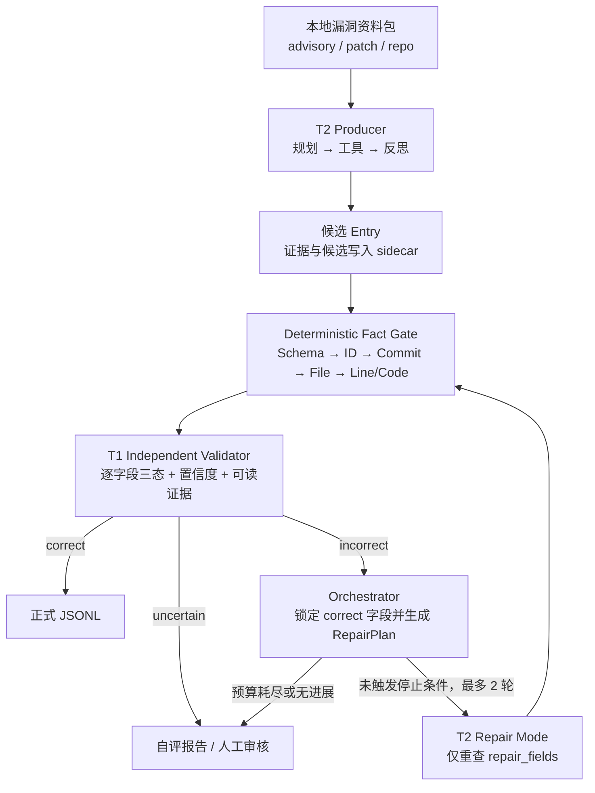

# VulnGym T1 × T2 自动化闭环：B-v2 首版设计

> 状态：确定性基础与 FakeT2 闭环骨架，2026-08-20。本文以考题、`SCHEMA.md` 和 B-v2 计划书为边界；“目标设计”不表示真实 T2 或语义 Judge 已经完成。

## 1. 目标与总体架构

B-v2 用 T2 生产候选，Fact Gate 消除可机械核验的错误，再由与 T2 推理隔离的 T1 逐字段盲审。T1 发现明确错误后，Orchestrator 生成 `RepairPlan`，T2 只重做错误字段；初始候选之后最多自动修复两轮，仍不收敛或证据不足则转人工。



T1 只接收原始资料包和待审 Entry，不读取 T2 的推理或自报置信度。目标 Prompt 约束为：Planner 输出结构化步骤与停止条件；Semantic Judge 只能依据已展示证据并列出反证；Reviewer/Reflection 先看硬事实，再检查 fix/vuln commit、修复后代码、内部 helper 和普通中间节点等高频误判。该 Agent/Prompt 层尚未实现。

## 2. 核心契约

### 2.1 Deterministic-first 与语义边界

硬事实按 `Schema/ID → commit 对象 → 精确路径 → 行号 → ±5 行代码匹配` 执行，失败直接形成结构化证据。通过门禁只代表“事实存在”：commit 存在不证明它是漏洞版本，代码匹配也不证明外部可达性或漏洞语义。因此 `fact_status=correct` 仍可对应 `status=uncertain`，语义必须由公告、patch 和漏洞版本源码交叉裁决。

`critical_operation` 采用双模式：

- **Sink 模式**：面向 XSS、注入、SSRF、路径访问等，从 patch 找危险操作变化，再回到漏洞 commit 确认真正 sink；不得引用修复后新增代码。
- **Guard 模式**：面向鉴权、租户隔离和状态机错误，定位错误/缺失的条件、归属检查或提前返回点。若漏洞版本没有有证据的可落地位置，则转人工，不能虚构行号。

Entry Point 需由路由、RPC/CLI、消息回调或反向调用关系证明“外部可达”。完整 trace 可为空数组，不能为补链而虚构节点。

### 2.2 正式输出、sidecar 与证据

| 边界 | 内容 | 约束 |
| --- | --- | --- |
| `outputs/entries.jsonl` | T2 正式 Entry | 仅 15 个 Schema 字段；`verify=0`；不得混入状态、证据、假设或日志。 |
| `outputs/validation.jsonl` | T1 正式报告 | 核心字段三态、置信度、可读证据，可附修正建议。 |
| `outputs/self_assessment.md` | 人工分流说明 | 汇总低置信、冲突和未收敛条目。 |
| `artifacts/*.jsonl` | 内部 sidecar | `evidence`、`candidates`、`tool_calls`、`repair_history`、`run_manifest`；不得回流污染 Entry。 |

统一证据模型如下；`line_start`/`line_end` 如出现必须成对且有序：

```json
{
  "evidence_id": "EV-GHSA-001-SOURCE-04",
  "report_id": "GHSA-W7XJ-8FX7-WFCH",
  "source_type": "source",
  "commit": "9942de8011d4b5a141ac507c974c061c0cdad59a",
  "file": "src/lib/components/common/RichTextInput.svelte",
  "line_start": 348,
  "line_end": 348,
  "snippet": "tempDiv.innerHTML = htmlContent;",
  "tool_call_id": "TOOL-00031"
}
```

`source_type` 取 `advisory/patch/source/git/schema` 之一；除 `evidence_id/report_id/source_type/snippet` 外，其余字段可选。`evidence_refs` 只用于追踪；T1 报告仍须内嵌可读证据。正式必填事实拿不到时不伪造 Entry：`vuln_ids`、`trace` 可用合法空数组，其余关键缺失进入人工队列。

### 2.3 离线、只读与预算

证据层默认离线：只读本地公告、patch 和仓库，禁止 HTTP 取数、`git fetch`、答案 API、执行仓库二进制/安装脚本或动态导入目标代码。严格离线配置使用本地模型；若显式启用远程 LLM，只发送最少片段，API Key 不入库、不入日志。

Git 工具用固定参数数组读取 `cat-file/ls-tree/show`，无任意 shell，不 checkout、不运行 hook/diff driver/textconv；校验 SHA 和相对路径，拒绝绝对路径、`..` 与选项/pathspec 注入，并限制超时和 blob 大小。确定性门禁只接受对象库位于授权根目录内的普通 clone/bare repo，拒绝 gitfile、`commondir`、alternate object database 和 `info/grafts` 历史覆盖；固定 `core.commitGraph=false` 使祖先关系回到原始 commit 对象，并以 `GIT_NO_REPLACE_OBJECTS=1` / `GIT_NO_LAZY_FETCH=1` 阻止 replace refs 与 partial clone 隐式联网/写对象。AST 如需展开源码，只能由后续受控工具创建每任务独立临时目录，不能把该目录绕回只读事实门禁。

确定性输入门禁已接入资源上限：默认单行 JSONL 1 MiB、每批 10,000 条、每条 trace 64 节点、每包 64 个文件；对应硬上限为 32 MiB、100,000 条、256 节点和 256 文件。超限在仓库/Git 扇出前形成结构化单条错误，超长行以固定大小缓冲排空。闭环预算默认每任务 `max_llm_calls=16`、`max_tool_calls=80`、`max_repair_iterations=2`；调用开始前计费，失败不退款，事件账本不含时间或随机值，因而可确定性重放。全字段正确、只剩 `uncertain`、两轮耗尽、无变化/错误重复、预算耗尽、改坏锁定字段、原正确字段回归或证据冲突时立即停止。`uncertain` 不会被自动改写，直接进入人工分流。

## 3. 交付边界与实施状态

### Standard 与 Bonus

B-v2 的 Standard 包含：T1 全核心字段三态、可读证据、多源与批处理；T2 全必填字段、漏洞/fix commit 区分、真实代码位置和 Entry/Critical 语义；以及基础 Guard、Fact Gate、两轮修复、错误隔离和离线安全。B-v2 将题目加分方向中的 Guard 与 T1×T2 联动提升为 Standard。

Bonus 后置为完整 trace、多语言 AST/轻量数据流、系统性错误归因、复杂 merge/backport、完整 taint 与自动发布。Standard 不建设第三个 Repair Agent、通用平台或远程 Artifact Store。

### 当前已实现：第四阶段闭环契约与 FakeT2 状态机骨架

- 三份严格机器契约：Entry、Validation、Evidence Schema；`additionalProperties=false`，并有 `EvidenceItem`、`FieldValidation`、`ValidationReport` 可序列化模型。
- `SchemaAdapter` 覆盖 15 个正式字段、额外/缺失字段、行范围、GHSA URL 与 `report_id` 一致性、ID 大写/去重/CVE-before-GHSA 排序及正式 T2 的 `verify=0`；它不会补造内容字段。
- `LocalEvidencePackage` 支持每行 `{"package": {...}, "entry": {...}}`，在显式只读根内读取必填公告和可选引用/patch。它拒绝绝对路径、盘符/UNC、`..`、反斜杠、控制符、符号链接、junction/reparse point、重复路径和越界输出；默认单文件/单包/文件数上限为 8 MiB、32 MiB、64，并记录原始字节 SHA-256。加载前后核对完整父链 identity；POSIX 支持时逐级使用目录句柄与 no-follow 打开，Windows 额外核对已打开句柄的最终内核路径。原始 Entry 行继续兼容。
- 公告事实层只提取正文中出现的 GHSA/CVE 和显式标注的 fix commit；`report_id/source_link/vuln_ids` 可与本地公告独立核对。缺公告、不可读或歧义返回 `uncertain`，明确错配与危险资料路径返回 `incorrect`。
- 只读 `GitRepository` 除对象/路径/源码外，已支持全部父提交、祖先关系、历史完整性判断和有界的进程内 UTF-8 unified diff；仍不执行 checkout/fetch/hook/textconv/diff driver。`CommitTransitionValidator` 能明确拒绝 candidate==fix、非祖先和声明路径未变化；正向拓扑/diff 事实仍不冒充漏洞语义证明。
- `T1DeterministicValidator` 已将公告与 Git 历史事实接入字段级报告；无法读取的可选 package 文件通过 `evidence_package=uncertain`、闭合 Evidence 引用与 `missing_information` 明示，不会静默丢弃。`python -m vulngym_agent` 支持 JSONL 逐行错误隔离、单仓库或 `repo_url → 本地路径` 映射，并原子写出 `validation.jsonl`、`evidence.jsonl` 与 `run_manifest.jsonl`。
- `PatchAnalyzer` 有界解析 Git 或本地 unified diff，输出 changed files/hunks、added/removed 坐标、Guard/early-return/removed-dangerous-call 词法候选、冲突与未决项；本地 patch 可与同一路径的不可变 Git diff 交叉核对。解析事实与漏洞语义分开，`semantic_status` 固定为 `uncertain`。
- `CriticalOperationResolver` 以 Sink/Guard 双模式核对候选是否位于漏洞 commit 的真实源码及 fix diff 的 removed/replaced side。fix 新增 Guard 只作为旧版控制流缺口线索，不会被转换为漏洞版本位置；即使事实完全吻合，最终角色仍为 `uncertain`。
- `EntryPointSearcher` 只读取调用者显式提供的不可变 Git blob，支持 Python、JS/TS、Java、Go、Ruby、PHP 的 route/RPC/CLI/handler/export 结构线索，并执行文件数、总字节和候选数预算。它不枚举仓库，也不声称运行时可达性或到达 Critical 的调用图已经证明。
- `T1DeterministicValidator` 已组合以上三层：Patch 解析失败被隔离到单条记录，字段仍保留可读证据与完整 evidence refs；结构事实绝不把 Entry/Critical 字段提升为语义 `correct`。以上仍是确定性基础设施，不是完整 T1/T2 Agent。
- `RunTask`、`ProductionOutcome`、`ToolCallRecord`、`RepairPlan`、`Budget` 与 sanitized `RunState` 已形成严格契约。T2 正式候选强制只有 15 字段且 `verify=0`，producer 的 evidence/tool calls/assumptions 与候选物理分离；`RepairPlan` 对 repair/dependent/locked 字段做完整分区，并以 canonical SHA-256 锁定不可改字段。
- `ClosedLoopOrchestrator` 已可由确定性 FakeT2 驱动：每轮创建全新 T1，仅传原始任务与正式候选；初始候选后最多修复两轮、最多验证三次。它拒绝越权改锁字段、无变化、错误重复、原正确字段回归、未计费工具调用及跨轮 sidecar ID 冲突，所有停止原因进入 Schema-valid 状态快照。快照以 canonical digest 和轮次拓扑保证内部重放闭包，但不是数字签名；若要证明持久化记录未被拥有写权限的一方整体重写，仍须外部签名或可信事件根。真实 T2 尚未接入，因此这是可测试的控制面闭环，不是数据生产能力本身。

尚未实现：受影响版本范围裁决、merge/backport/squash 的唯一漏洞 commit 解析、AST/调用图/数据流支撑的分类/标题/Entry/Critical 最终语义判断、完整 T1 Prompt/反思循环、真实 T2 Producer/Repair Mode，以及批量闭环 CLI 与完整工具回放。当前批处理覆盖 T1 的资料、Schema、ID、Git 历史、源码位置、Patch 结构与入口线索事实门禁；闭环成功路径暂由 FakeT2/FakeValidator 测试，不会放宽真实 T1 来伪造 `correct`。

### 下一阶段

下一阶段实现真实 T2 Producer 与受限 Repair Mode，并把状态机接入逐任务隔离的批量 CLI、candidate/tool-call/repair-history sidecar。随后增加受影响版本、合并/回移修复边界和语义 Judge；只有这些 Standard 能力在训练/公开集上稳定后，才投入完整 trace、AST/数据流与更多语言增强。
